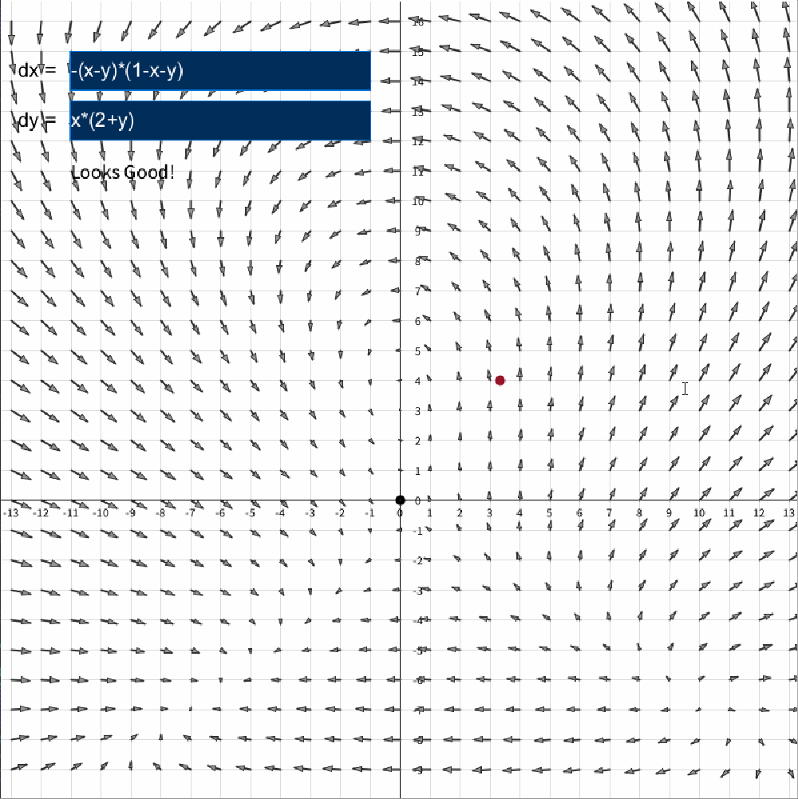
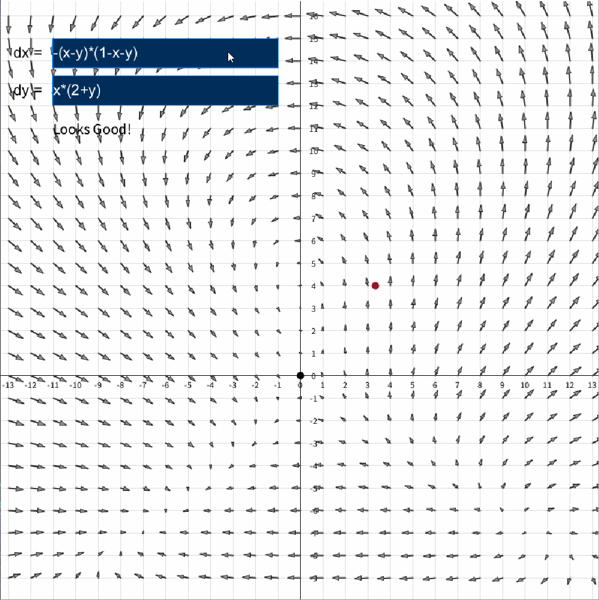
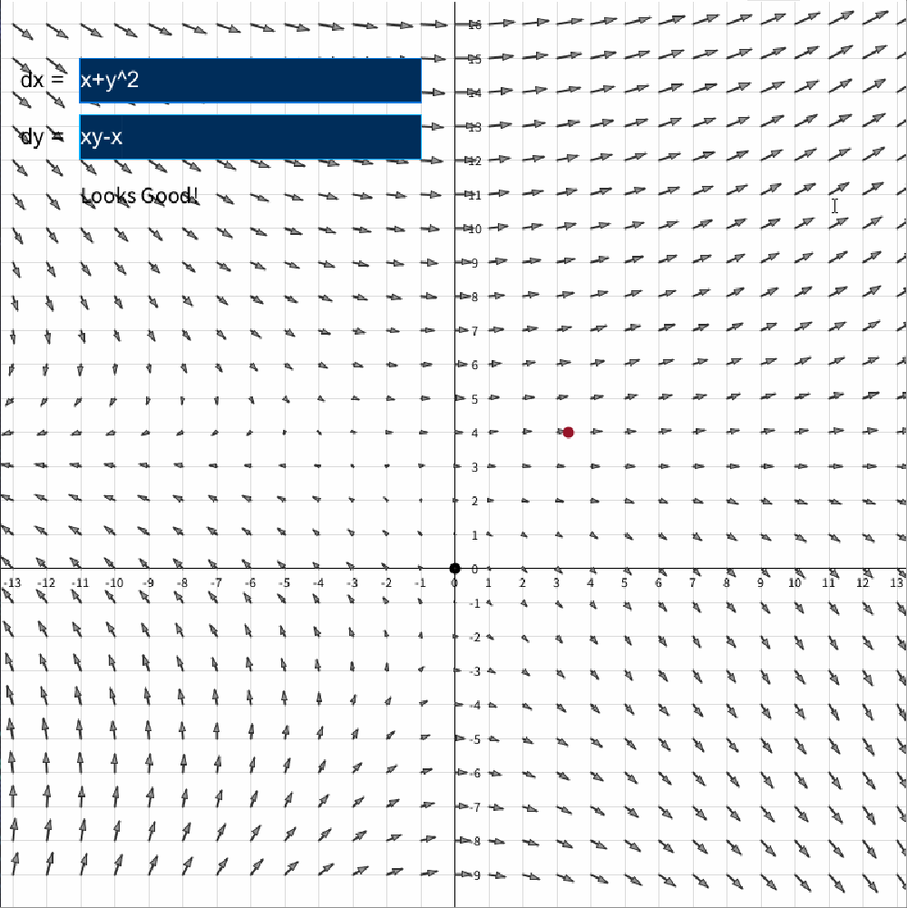

# Phase Plane Plot for Nonlinear Systems
## Introduction
This is a simple phase plane plotter built with Processing.
Users can input differential equations and visualize their vector fields in real time.
## Requirements
- Download all files from this repository.
- Download [Processing](https://processing.org/download).
- Make sure to install the ControlP5 GUI library from Processing.
  - Step: Open Processing > Sketch > Import Library... > Manage Libraries... > Search for Control P5
- Open Processing and run the [PDE file](plase_plane_plot/plase_plane_plot.pde). 
## How to Use
- Left click and drag the grid.
- Right click to place a red dot.
- Scroll up and down to simulate the dot moving in real time.
- Custom input for dx and dy, enter for confirm.
## Demo

## Citation
- I used the [exp4j Library](https://github.com/fasseg/exp4j) for parsing mathematical expressions. 

